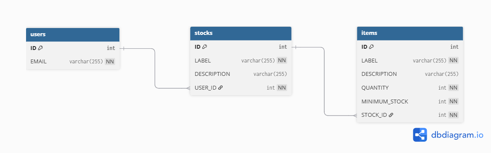

# StockHub Backend — API V2


StockHub est une application web conçue pour aider les familles à gérer leurs stocks de produits (alimentaires, artistiques...).
Elle permet aux utilisateurs de visualiser l'état des stocks et de les mettre à jour facilement.

---

## 🌍 Environnements

| Environnement  | URL                                                                    | Status                         |
| -------------- | ---------------------------------------------------------------------- | ------------------------------ |
| **Local**      | `http://localhost:3006`                                                | Docker Compose                 |
| **Staging**    | https://stockhub-back.onrender.com                                     | Render.com (branche `staging`) |
| **Production** | https://stockhub-back-bqf8e6fbf6dzd6gs.westeurope-01.azurewebsites.net | Azure App Service              |

### Documentation API (Swagger UI)

| Environnement | Swagger UI                                                                      | OpenAPI JSON                                     |
| ------------- | ------------------------------------------------------------------------------- | ------------------------------------------------ |
| Local         | http://localhost:3006/api-docs                                                  | http://localhost:3006/api-docs.json              |
| Staging       | https://stockhub-back.onrender.com/api-docs                                     | https://stockhub-back.onrender.com/api-docs.json |
| Production    | https://stockhub-back-bqf8e6fbf6dzd6gs.westeurope-01.azurewebsites.net/api-docs | —                                                |

---

## 🚀 Démarrage rapide (Local — Docker)

```bash
git clone https://github.com/SandrineCipolla/stockhub_back.git
cd stockhub_back
npm install

# Créer .env.docker avec les variables Azure B2C (voir docs/technical/environments-setup.md)

# Démarrer MySQL + API
docker compose up -d

# Seeder la base (première fois uniquement)
docker compose exec api sh -c "SEED_OWNER_EMAIL=ton.email@b2c.com npm run db:seed"
```

API disponible sur **http://localhost:3006**

> 📖 Guide complet multi-environnements : [docs/technical/environments-setup.md](./docs/technical/environments-setup.md)

---

## 🧪 Tester avec Postman

Importer depuis le repo :

| Fichier                                             | Description                                 |
| --------------------------------------------------- | ------------------------------------------- |
| `Stockhub_V2.postman_collection.json`               | Collection complète (tous les endpoints v2) |
| `postman/Stockhub_Local.postman_environment.json`   | Environnement local (`localhost:3006`)      |
| `postman/Stockhub_Staging.postman_environment.json` | Environnement staging (Render)              |
| `postman/Stockhub_Prod.postman_environment.json`    | Environnement prod (Azure)                  |

**Flow** : sélectionner un environnement → renseigner `username`/`password` → lancer `🔑 Get Token` → token Bearer sauvegardé automatiquement.

---

## 1. Introduction métier

### Problématique

Visualiser rapidement les quantités en notre possession, que l'on soit à la maison ou en plein shopping, afin d'éviter les
ruptures ou les doublons. Mettre à jour facilement les stocks après utilisation d'un article ou des achats.

### Public cible

Usage personnel/familial → visibilité rapide sur les stocks, valeur ajoutée = meilleure planification, moins d'oublis.

### Module choisi

**Visualisation et manipulation des stocks** (liste + détail + CRUD complet). Gestion de scopes pour les utilisateurs
(partage familial avec rôles).

## 2. Périmètre fonctionnel

### Inclus (V2)

- `GET /api/v2/stocks` → liste des stocks de l'utilisateur
- `GET /api/v2/stocks/{stockId}` → détail d'un stock
- `POST /api/v2/stocks` → créer un stock
- `PATCH /api/v2/stocks/{stockId}` → modifier un stock
- `DELETE /api/v2/stocks/{stockId}` → supprimer un stock (cascade items)
- `GET /api/v2/stocks/{stockId}/items` → items d'un stock
- `POST /api/v2/stocks/{stockId}/items` → ajouter un item
- `PATCH /api/v2/stocks/{stockId}/items/{itemId}` → modifier la quantité
- Entités DDD (`Stock`, `StockItem`, `Quantity`) + service `StockVisualizationService`
- Autorisation par rôles (OWNER / EDITOR / VIEWER / VIEWER_CONTRIBUTOR)

## 3. Cas d'usage

1. En tant qu'utilisateur, je veux pouvoir consulter mon stock d'aquarelle lorsque je suis au "Géants des beaux-arts"
   afin de ne pas acheter une référence en double malgré la super promo de rentrée.

2. En tant qu'utilisateur, je veux pouvoir consulter mes stocks alimentaires pour faire ma liste de courses avant de
   passer ma commande drive.

## 4. Choix techniques

### Architecture

DDD/CQRS avec séparation stricte des couches :

```
src/
├── domain/
│   ├── stock-management/
│   │   ├── manipulation/      # Command side (CQRS — Write)
│   │   └── visualization/     # Query side (CQRS — Read)
│   └── authorization/         # Entités famille, rôles
├── infrastructure/             # Repositories Prisma
├── api/                        # Controllers, routes, DTOs
├── authentication/             # Azure AD B2C (Passport Bearer)
├── authorization/              # Middleware autorisation stocks
└── config/
```

**Règle absolue** : domain → infrastructure → api (jamais l'inverse)

### Tests

TDD appliqué sur `Quantity`, `StockItem`, `Stock`, puis `StockVisualizationService`.

### Sécurité

- **Authentification** : Azure AD B2C avec tokens JWT Bearer (routes V1 et V2)
- **Autorisation** : Système hybride basé sur les ressources (voir [ADR-009](./docs/adr/ADR-009-resource-based-authorization.md))
  - Groupes familiaux + rôles par stock (OWNER/EDITOR/VIEWER/VIEWER_CONTRIBUTOR)
  - Workflow de suggestions pour collaboration sécurisée

### Base de données

MySQL — Prisma ORM + migrations.

### Documentation API (OpenAPI 3.0)

📖 La documentation OpenAPI 3.0 couvre tous les endpoints v2 avec schémas, exemples, authentification Azure AD B2C et séparation Read/Write (CQRS).

⚠️ **Maintenance** : Le fichier `docs/openapi.yaml` doit être mis à jour manuellement lors de toute modification des routes ou DTOs.

### Cloud

Azure App Service (prod) + Render.com (staging) + Docker Compose (local).

## 📚 Documentation Architecture

### Architecture Decision Records (ADRs)

Les **ADRs** documentent les décisions techniques majeures du projet avec leur contexte, alternatives considérées, et conséquences.

📖 **[Voir tous les ADRs](./docs/adr/INDEX.md)**

| #                                                                | Décision                                    | Date     |
| ---------------------------------------------------------------- | ------------------------------------------- | -------- |
| [ADR-001](./docs/adr/ADR-001-migration-ddd-cqrs.md)              | Migration vers DDD/CQRS                     | Nov 2025 |
| [ADR-002](./docs/adr/ADR-002-choix-prisma-orm.md)                | Choix de Prisma vs TypeORM                  | Déc 2025 |
| [ADR-003](./docs/adr/ADR-003-azure-ad-b2c-authentication.md)     | Azure AD B2C pour authentification          | Déc 2025 |
| [ADR-004](./docs/adr/ADR-004-tests-value-objects-entities.md)    | Tests sur Value Objects et Entities         | Déc 2025 |
| [ADR-005](./docs/adr/ADR-005-api-versioning-v2.md)               | Versioning API (V2 sans V1)                 | Déc 2025 |
| [ADR-006](./docs/adr/ADR-006-mysql-azure-cloud.md)               | MySQL Azure vs autres clouds                | Déc 2025 |
| [ADR-007](./docs/adr/ADR-007-code-quality-enforcement.md)        | Standards de qualité de code stricts        | Déc 2024 |
| [ADR-008](./docs/adr/ADR-008-typescript-request-type-aliases.md) | Type Aliases pour requêtes Express typées   | Déc 2025 |
| [ADR-009](./docs/adr/ADR-009-resource-based-authorization.md)    | Système d'autorisation hybride              | Déc 2025 |
| [ADR-010](./docs/adr/ADR-010-ci-cd-pipeline-optimization.md)     | Optimisation pipeline CI/CD (8min → 4-5min) | Déc 2025 |

📚 **[Documentation complète du projet](https://github.com/SandrineCipolla/stockHub_V2_front/wiki)** — Architecture, guides techniques, métriques

## 5. Base de données

### Diagramme relationnel



### Schéma actuel (Prisma)

```
users    → id, email
stocks   → id, label, description, category, userId
items    → id, label, description, quantity, minimumStock, stockId
```

### Relations

- **users (1) → (N) stocks** : Un utilisateur possède plusieurs stocks
- **stocks (1) → (N) items** : Un stock contient plusieurs items (cascade delete)

### Évolutions prévues

Système de scopes pour les utilisateurs (partage de stocks entre membres d'une famille).
Les utilisateurs pourront faire des demandes de réapprovisionnement au propriétaire du stock.

## 6. API V2

### Endpoints

```
GET    /api/v2/stocks                         → Liste des stocks de l'utilisateur
GET    /api/v2/stocks/:stockId                → Détail d'un stock
POST   /api/v2/stocks                         → Créer un stock
PATCH  /api/v2/stocks/:stockId                → Modifier un stock
DELETE /api/v2/stocks/:stockId                → Supprimer (cascade items)
GET    /api/v2/stocks/:stockId/items          → Items d'un stock
POST   /api/v2/stocks/:stockId/items          → Ajouter un item
PATCH  /api/v2/stocks/:stockId/items/:itemId  → Modifier la quantité
```

Catégories valides : `alimentation` | `hygiene` | `artistique`

### Exemple de réponse

```json
{
  "id": 1,
  "label": "Cuisine",
  "description": "Stock alimentaire",
  "category": "alimentation",
  "items": [
    { "label": "Pâtes", "quantity": { "value": 5 }, "minimumStock": 2 },
    { "label": "Riz", "quantity": { "value": 0 }, "minimumStock": 1 }
  ]
}
```

## 7. Scripts disponibles

```bash
# Développement
npm run start:dev        # Serveur local avec hot reload (localhost:3006)

# Docker
docker compose up -d     # Démarrer MySQL + API
docker compose down      # Arrêter (données conservées)
docker compose down -v   # Arrêter + supprimer les données

# Base de données
npm run db:seed          # Seeder (dans le container Docker)
npx prisma migrate dev   # Nouvelle migration
npx prisma migrate deploy # Appliquer les migrations
npx prisma studio        # Interface visuelle DB

# Tests
npm run test:unit        # 142 tests unitaires
npm run test:integration # Tests d'intégration (TestContainers)
npm run test:e2e         # Tests E2E Playwright
npm run test:coverage    # Rapport de couverture

# Build & Qualité
npm run build            # Build Webpack → dist/index.js
npm run lint             # ESLint 0 warnings
npm run format           # Prettier

# Azure (gestion quota F1 — 60 min CPU/jour)
npm run azure:start      # Démarrer l'app Azure avant de tester prod
npm run azure:stop       # Arrêter l'app Azure après les tests
```

## 8. Tests

### Unitaires (TDD)

- `Quantity` : valeurs invalides interdites
- `StockItem` : `isOutOfStock()`, `isLowStock()`
- `Stock` : `getTotalItems()`, `getTotalQuantity()`
- `StockVisualizationService` : cas vide, cas stocks présents, cas 404

### Tests d'Intégration

Tests des services et repositories avec base de données réelle (TestContainers MySQL).

### Tests E2E ✅

Tests fonctionnels complets avec **authentification Azure AD B2C réelle** via Playwright.

**Workflow testé** :

1. ✅ Authentification Azure AD B2C (ROPC)
2. ✅ Création d'un stock
3. ✅ Ajout d'items au stock
4. ✅ Visualisation du stock
5. ✅ Mise à jour de quantités
6. ✅ Détection des items en rupture
7. ✅ Nettoyage automatique des données de test

```bash
npm run test:e2e         # Tests E2E standard
npm run test:e2e:ui      # Interface UI Playwright
npm run test:e2e:headed  # Avec navigateur visible
```

## 9. 🧪 Procédure de test utilisateur

### Objectif

Valider le fonctionnement complet du module DDD depuis la création de compte jusqu'à la manipulation des stocks.

### Prérequis

- Navigateur web avec DevTools
- Adresse email valide pour Azure B2C
- Application frontend : https://stock-hub-v2-front.vercel.app/

### Procédure

#### 1. Créer un compte via Azure AD B2C

1. Accéder à https://stock-hub-v2-front.vercel.app/
2. Cliquer "Se connecter" → portail Azure B2C
3. Créer un compte (email + mot de passe + vérification email)

#### 2. Vérifier l'authentification

- DevTools → Application → Local Storage → token JWT présent ✅
- DevTools → Network → header `Authorization: Bearer [token]` sur les requêtes ✅

#### 3. Tester l'API V2

**Liste des stocks** :

```bash
GET /api/v2/stocks
Authorization: Bearer [JWT_TOKEN]
# → 200 OK, array de stocks
```

**Créer un stock** :

```bash
POST /api/v2/stocks
Authorization: Bearer [JWT_TOKEN]
Content-Type: application/json

{ "label": "Stock Cuisine", "description": "Produits alimentaires", "category": "alimentation" }
# → 201 Created
```

**Vérification Network (DevTools F12 > Network)** :

- ✅ `GET /api/v2/stocks` → 200 OK, structure DDD
- ✅ `POST /api/v2/stocks` → 201 Created
- ✅ `PATCH /api/v2/stocks/:id` → 200 OK
- ✅ `DELETE /api/v2/stocks/:id` → 204 No Content

#### Script de validation rapide (curl)

```bash
export JWT_TOKEN="eyJ0eXAiOiJKV1Qi..."  # Token récupéré depuis DevTools

# Test API V2
curl -X GET "https://stockhub-back-bqf8e6fbf6dzd6gs.westeurope-01.azurewebsites.net/api/v2/stocks" \
     -H "Authorization: Bearer $JWT_TOKEN"

# Test sans token (doit retourner 401)
curl -X GET "https://stockhub-back-bqf8e6fbf6dzd6gs.westeurope-01.azurewebsites.net/api/v2/stocks"
```

#### Checklist de test

- [ ] Création de compte réussie + vérification email
- [ ] Connexion fonctionnelle + token JWT présent
- [ ] `GET /api/v2/stocks` → 200 OK
- [ ] `POST /api/v2/stocks` → 201 Created
- [ ] `PATCH /api/v2/stocks/:id` → 200 OK
- [ ] `DELETE /api/v2/stocks/:id` → 204 No Content
- [ ] Routes sans token → 401 Unauthorized

## 10. Sécurité & performances

### Authentification

Middleware Azure Bearer appliqué sur **toutes les routes** :

```typescript
app.use('/api/v2', authenticationMiddleware, stockRoutesV2);
app.use('/api/v1', authenticationMiddleware, stockRoutes);
```

- 🔒 `/api/v1` protégé (Bearer Token requis)
- 🔒 `/api/v2` protégé (Bearer Token requis)

### Performance

- Index SQL sur `stocks.userId`, `items.stockId`
- Prisma `include` pour éviter N+1
- Application Insights pour monitoring et logs

## 11. CI/CD

| Job                      | Déclencheur                          |
| ------------------------ | ------------------------------------ |
| `continuous-integration` | Tous les push / PR                   |
| `e2e-tests`              | PR vers `main` + `workflow_dispatch` |
| `deploy-to-staging`      | `workflow_dispatch` uniquement       |
| `build-and-deploy`       | Push sur `main` → Azure              |

## 12. Déploiement

| Environnement | Plateforme                     | Déclenchement           |
| ------------- | ------------------------------ | ----------------------- |
| Local         | Docker Compose                 | `docker compose up -d`  |
| Staging       | Render.com (branche `staging`) | Auto sur push `staging` |
| Production    | Azure App Service              | Auto sur push `main`    |

**Infrastructure production** :

- **Azure App Service** : Backend Node.js
- **Azure MySQL Flexible Server** : Base de données
- **Azure AD B2C** : Authentification OAuth2
- **Application Insights** : Monitoring, logs, alertes

> ⚠️ **Quota Azure F1** : 60 min CPU/jour — `npm run azure:stop` après les tests, `npm run azure:start` avant.

---

**Stack** : Node.js · TypeScript · Express · MySQL · Prisma · Azure AD B2C
**Architecture** : DDD/CQRS · Repository Pattern
**Tests** : Jest · TestContainers · Playwright
**Cloud** : Azure App Service · Render.com (staging) · Aiven MySQL (staging)
