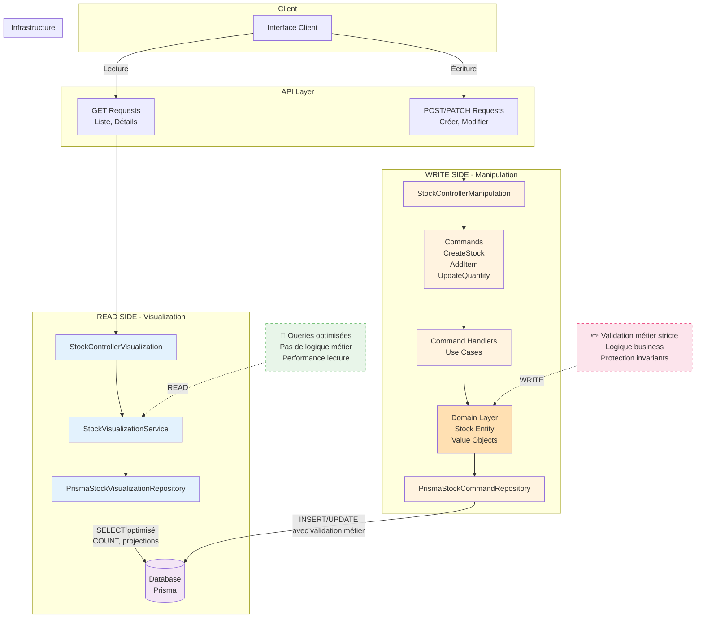

# Architecture DDD/CQRS - StockHub Backend

**Version:** 1.0
**Date:** Décembre 2024
**Statut:** En production partielle (READ side complet, WRITE side en cours)

---

## Vue d'ensemble

Le backend StockHub suit une architecture **Domain-Driven Design (DDD)** avec séparation **CQRS (Command Query Responsibility Segregation)** pour le module de gestion des stocks.

### Principes architecturaux

1. **Séparation READ/WRITE** : Deux modèles distincts pour la lecture (queries) et l'écriture (commands)
2. **Logique métier dans le domaine** : Pas de logique business dans les controllers/services
3. **Indépendance de la base de données** : Le domaine ne connaît pas Prisma
4. **Testabilité** : Chaque couche est testable indépendamment

---

## Architecture en couches

```
┌─────────────────────────────────────────────────────────────────┐
│                         API Layer                                │
│  - Controllers (HTTP endpoints)                                  │
│  - Routes configuration                                          │
│  - DTOs (Data Transfer Objects)                                  │
│  - Request/Response validation                                   │
└─────────────────────────────────────────────────────────────────┘
                              │
                              ▼
┌─────────────────────────────────────────────────────────────────┐
│                    Application Layer                             │
│  - Command Handlers (orchestration)                              │
│  - Query Handlers (orchestration)                                │
│  - Use Cases / Business Workflows                                │
│  - Application Services                                          │
└─────────────────────────────────────────────────────────────────┘
                              │
                              ▼
┌─────────────────────────────────────────────────────────────────┐
│                      Domain Layer                                │
│  - Entities (Stock, StockItem)                                   │
│  - Value Objects (StockLabel, Quantity, etc.)                    │
│  - Domain Events                                                 │
│  - Repository Interfaces                                         │
│  - Business Rules & Invariants                                   │
└─────────────────────────────────────────────────────────────────┘
                              │
                              ▼
┌─────────────────────────────────────────────────────────────────┐
│                  Infrastructure Layer                            │
│  - Prisma Repository Implementations                             │
│  - Database Migrations                                           │
│  - External Services Integration                                │
│  - Logging (Application Insights)                                │
└─────────────────────────────────────────────────────────────────┘
```

---

## Séparation CQRS

### Diagramme CQRS



**Légende:**

- 🔵 **Bleu (READ)** : Optimisé pour la lecture, pas de logique métier
- 🟠 **Orange (WRITE)** : Validation métier stricte, protection des invariants
- 🟣 **Violet (Domain)** : Cœur métier, règles business

---

### READ Side (Queries - Visualization)

**Responsabilité:** Lecture optimisée des données pour l'affichage

```
src/domain/stock-management/visualization/
├── queries/
│   └── IStockVisualizationRepository.ts
└── services/
    └── StockVisualizationService.ts

src/infrastructure/stock-management/visualization/
└── repositories/
    └── PrismaStockVisualizationRepository.ts

src/api/controllers/
└── StockControllerVisualization.ts
```

**Routes:**

- `GET /api/v2/stocks` - Liste tous les stocks
- `GET /api/v2/stocks/:id` - Détails d'un stock
- `GET /api/v2/stocks/:id/items` - Items d'un stock

**Caractéristiques:**

- Requêtes SQL optimisées pour la lecture
- Pas de logique métier (juste projection de données)
- Peut utiliser des vues ou dénormalisation si nécessaire

---

### WRITE Side (Commands - Manipulation)

**Responsabilité:** Modification des données avec validation métier

```
src/domain/stock-management/manipulation/
├── commands(Request)/
│   ├── CreateStockCommand.ts
│   ├── AddItemToStockCommand.ts
│   └── UpdateItemQuantityCommand.ts
├── command-handlers(UseCase)/
│   ├── CreateStockCommandHandler.ts
│   ├── AddItemToStockCommandHandler.ts
│   └── UpdateItemQuantityCommandHandler.ts
└── repositories/
    └── IStockCommandRepository.ts

src/infrastructure/stock-management/manipulation/
└── repositories/
    └── PrismaStockCommandRepository.ts

src/api/controllers/
└── StockControllerManipulation.ts
```

**Routes:**

- `POST /api/v2/stocks` - Créer un stock
- `POST /api/v2/stocks/:id/items` - Ajouter un item
- `PATCH /api/v2/stocks/:id/items/:itemId` - Modifier quantité

**Caractéristiques:**

- Validation métier stricte dans les entités
- Commandes immuables (DTOs)
- Logique métier dans Stock.addItem(), Stock.updateItemQuantity()

---

## Couche Domain (Cœur métier)

### Entities (Identité + Comportement)

```typescript
// Stock - Agrégat racine
export class Stock {
    constructor(
        public id: number,
        public label: string | StockLabel,
        public description: string | StockDescription,
        public category: string,
        public items: StockItem[] = []
    ) {}

    // Factory method
    static create(params: {...}): Stock {
        const label = new StockLabel(params.label);
        const description = new StockDescription(params.description);
        return new Stock(0, label, description, params.category, []);
    }

    // Logique métier
    addItem(params: {...}): StockItem {
        // Validation: label non vide
        // Règle business: pas de duplicates
        // Création de l'item et ajout à la collection
    }

    updateItemQuantity(itemId: number, quantity: number): void {
        // Validation: quantité >= 0
        // Règle business: item doit exister
    }

    getLowStockItems(): StockItem[] {
        return this.items.filter(item => item.isLowStock());
    }
}
```

**Règles:**

- Les entités ont une **identité** (id)
- Elles contiennent la **logique métier**
- Elles protègent leurs **invariants** (règles toujours vraies)

---

### Value Objects (Valeur + Validation)

```typescript
export class StockLabel {
  private readonly value: string;
  private static readonly MIN_LENGTH = 3;
  private static readonly MAX_LENGTH = 50;

  constructor(label: string) {
    if (typeof label !== 'string') {
      throw new Error('Stock label must be a string.');
    }
    const normalized = label.trim();
    if (normalized.length < StockLabel.MIN_LENGTH) {
      throw new Error(`Stock label must be at least ${StockLabel.MIN_LENGTH} characters.`);
    }
    if (normalized.length > StockLabel.MAX_LENGTH) {
      throw new Error(`Stock label must not exceed ${StockLabel.MAX_LENGTH} characters.`);
    }
    this.value = normalized;
  }

  public getValue(): string {
    return this.value;
  }
}
```

**Caractéristiques:**

- **Immuables** (readonly)
- **Pas d'identité** (deux StockLabel("cuisine") sont identiques)
- **Auto-validation** (impossible de créer un objet invalide)
- **Encapsulation** (value est private)

**Value Objects du domaine:**

- `StockLabel` - Label du stock (3-50 caractères)
- `StockDescription` - Description (non vide)
- `Quantity` - Quantité (>= 0)

---

## Couche Application

### Commands (DTOs immuables)

```typescript
export class CreateStockCommand {
  constructor(
    public readonly label: string,
    public readonly description: string,
    public readonly category: string,
    public readonly userId: number
  ) {}
}
```

**Règles:**

- **Immuables** (readonly)
- **Pas de logique** (juste transport de données)
- Représentent une **intention** de modification

---

### Command Handlers (Orchestration)

```typescript
export class CreateStockCommandHandler {
  constructor(private readonly stockRepository: IStockCommandRepository) {}

  async handle(command: CreateStockCommand): Promise<Stock> {
    // 1. Créer l'entité (validation automatique via Value Objects)
    const stock = Stock.create({
      label: command.label,
      description: command.description,
      category: command.category,
      userId: command.userId,
    });

    // 2. Persister
    return await this.stockRepository.save(stock, command.userId);
  }
}
```

**Responsabilités:**

1. Orchestrer le use case
2. Appeler les méthodes du domaine
3. Déléguer la persistence au repository

**Ce qu'ils ne font PAS:**

- ❌ Validation métier (c'est le rôle du domaine)
- ❌ Accès direct à la DB (c'est le rôle du repository)

---

## Couche Infrastructure

### Repository Prisma

```typescript
export class PrismaStockCommandRepository implements IStockCommandRepository {
    constructor(private prisma?: PrismaClient) {
        this.prisma = prisma ?? new PrismaClient();
    }

    async save(stock: Stock, userId: number): Promise<Stock> {
        // Conversion Stock (domaine) → Prisma model
        const created = await this.prisma.stocks.create({
            data: {
                LABEL: stock.getLabelValue(),
                DESCRIPTION: stock.getDescriptionValue(),
                CATEGORY: stock.category,
                USER_ID: userId
            }
        });

        // Conversion Prisma model → Stock (domaine)
        return new Stock(
            created.ID,
            created.LABEL,
            created.DESCRIPTION,
            created.CATEGORY,
            []
        );
    }

    async addItemToStock(stockId: number, item: {...}): Promise<Stock> {
        // 1. Récupérer le stock
        const stockData = await this.prisma.stocks.findUnique({...});

        // 2. Reconstituer l'entité domaine
        const stock = new Stock(...);

        // 3. Appeler la logique métier
        stock.addItem(item);  // ← Validation ici

        // 4. Persister
        await this.prisma.items.create({...});

        // 5. Retourner l'entité mise à jour
        return stock;
    }
}
```

**Pattern important:**

1. Charger les données Prisma
2. **Reconstituer l'entité domaine**
3. Appeler les méthodes métier (validation automatique)
4. Persister les changements

---

## Couche API

### Controller

```typescript
export class StockControllerManipulation {
  constructor(
    private readonly createStockHandler: CreateStockCommandHandler,
    private readonly addItemHandler: AddItemToStockCommandHandler,
    private readonly updateQuantityHandler: UpdateItemQuantityCommandHandler,
    private readonly userService: UserService
  ) {}

  public async createStock(req: AuthenticatedRequest, res: Response) {
    try {
      // 1. Extraire les données de la requête
      const { label, description, category } = req.body;
      const userID = await this.userService.convertOIDtoUserID(req.userID);

      // 2. Créer la commande
      const command = new CreateStockCommand(label, description, category, userID.value);

      // 3. Déléguer au handler
      const stock = await this.createStockHandler.handle(command);

      // 4. Logger et répondre
      rootMain.info(`createStock stockId=${stock.id}`);
      res.status(HTTP_CODE_CREATED).json(stock);
    } catch (err) {
      rootException(err as Error);
      sendError(res, err as CustomError);
    }
  }
}
```

**Responsabilités:**

- Extraction des données HTTP
- Création des Commands/Queries
- Appel des Handlers
- Formatage des réponses HTTP
- Gestion des erreurs

**Ce qu'il ne fait PAS:**

- ❌ Logique métier
- ❌ Accès direct à la DB
- ❌ Création d'entités domaine

---

## Flux de données

### WRITE - Créer un stock

```
1. Client
   POST /api/v2/stocks
   { label: "Stock Cuisine", description: "...", category: "alimentation" }
         │
         ▼
2. StockControllerManipulation.createStock()
   - Extrait: label, description, category, userID
   - Crée: CreateStockCommand
         │
         ▼
3. CreateStockCommandHandler.handle()
   - Crée: Stock.create() → Validation via StockLabel, StockDescription
         │
         ▼
4. PrismaStockCommandRepository.save()
   - Conversion: Stock → Prisma model
   - Persist: await prisma.stocks.create()
   - Conversion: Prisma model → Stock
         │
         ▼
5. Response
   201 Created
   { id: 42, label: "Stock Cuisine", ... }
```

### READ - Lister les stocks

```
1. Client
   GET /api/v2/stocks
         │
         ▼
2. StockControllerVisualization.getAllStocks()
   - Extrait: userID
         │
         ▼
3. StockVisualizationService.getAllStocks()
   - Pas de logique métier
         │
         ▼
4. PrismaStockVisualizationRepository.findAll()
   - SELECT optimisé
   - Pas de reconstitution d'entité (juste DTO)
         │
         ▼
5. Response
   200 OK
   [ { id: 1, label: "...", itemCount: 5 }, ... ]
```

---

## Avantages de cette architecture

### 1. Testabilité

**Domain:**

```typescript
// Test sans DB, sans HTTP
const stock = Stock.create({...});
stock.addItem({label: "Tomates", quantity: 10});
expect(stock.items).toHaveLength(1);
```

**Application:**

```typescript
// Test avec mock repository
const mockRepo = { save: jest.fn() };
const handler = new CreateStockCommandHandler(mockRepo);
await handler.handle(command);
expect(mockRepo.save).toHaveBeenCalled();
```

---

### 2. Évolutivité

**Ajouter une règle métier:**

```typescript
// ✅ Modification uniquement dans Stock.addItem()
addItem(params: {...}): StockItem {
    // Nouvelle règle: maximum 100 items par stock
    if (this.items.length >= 100) {
        throw new Error("Cannot add more than 100 items");
    }
    // ... reste du code inchangé
}
```

Aucun changement dans:

- ❌ Controller
- ❌ Handler
- ❌ Repository
- ❌ Tests d'intégration

---

### 3. Performance (CQRS)

**READ side:**

- Requêtes SQL optimisées
- Pas de chargement des relations inutiles
- Possibilité de dénormalisation future

**WRITE side:**

- Chargement complet de l'agrégat
- Validation métier stricte
- Moins sollicité que le READ

---

## Migration du legacy

### Ancien code (à supprimer progressivement)

```typescript
// ❌ Logique métier dans le service
class StockService {
    async createStock(label: string, description: string, userId: number) {
        // Validation ici (mauvais endroit)
        if (!label || label.length < 3) {
            throw new Error("Invalid label");
        }

        // Appel direct à la DB
        const stock = await this.writeStockRepository.createStock(...);
        return stock;
    }
}
```

### Nouveau code DDD

```typescript
// ✅ Validation dans Value Object
class StockLabel {
    constructor(label: string) {
        if (label.length < 3) throw new Error("...");
    }
}

// ✅ Factory dans l'entité
class Stock {
    static create(params: {...}): Stock {
        const label = new StockLabel(params.label);  // Validation auto
        return new Stock(0, label, ...);
    }
}

// ✅ Handler simple (orchestration)
class CreateStockCommandHandler {
    async handle(command: CreateStockCommand): Promise<Stock> {
        const stock = Stock.create(command);
        return await this.stockRepository.save(stock);
    }
}
```

---

## Règles et conventions

### Nommage

| Type                 | Convention                      | Exemple                        |
| -------------------- | ------------------------------- | ------------------------------ |
| Entity               | PascalCase                      | `Stock`, `StockItem`           |
| Value Object         | PascalCase                      | `StockLabel`, `Quantity`       |
| Command              | PascalCase + "Command"          | `CreateStockCommand`           |
| Handler              | PascalCase + "Handler"          | `CreateStockCommandHandler`    |
| Repository Interface | "I" + PascalCase + "Repository" | `IStockCommandRepository`      |
| Repository Impl      | PascalCase + "Repository"       | `PrismaStockCommandRepository` |

### Organisation des fichiers

```
src/domain/stock-management/
├── common/                           # Partagé READ/WRITE
│   ├── entities/
│   │   ├── Stock.ts
│   │   └── StockItem.ts
│   └── value-objects/
│       ├── StockLabel.ts
│       ├── StockDescription.ts
│       └── Quantity.ts
├── manipulation/                     # WRITE side
│   ├── commands(Request)/
│   ├── command-handlers(UseCase)/
│   └── repositories/
└── visualization/                    # READ side
    ├── queries/
    └── services/
```

---

## Testing Strategy

### Pyramide de tests

```
              E2E (1)
           ─────────────
         /               \
       Integration (2)
     ───────────────────────
   /                         \
  Unit (53)
──────────────────────────────────
```

**Unit Tests (53):**

- Value Objects: StockLabel, StockDescription, Quantity
- Entities: Stock (logique métier)
- Command Handlers: CreateStock, AddItem, UpdateQuantity

**Integration Tests (2):**

- PrismaStockCommandRepository (avec DB réelle)
- API v2 routes (end-to-end API layer)

**E2E Tests (1):**

- Scénario complet: Créer stock → Ajouter items → Visualiser → Modifier

---

## Prochaines étapes

### Court terme

- [ ] Migration complète du code legacy vers DDD
- [ ] Ajout de validation Joi/Zod sur les DTOs API
- [ ] Pagination des listes

### Moyen terme

- [ ] Domain Events pour audit trail
- [ ] Event Sourcing pour historique des modifications
- [ ] Cache Redis pour READ side

### Long terme

- [ ] Microservices (si nécessaire)
- [ ] Separate READ/WRITE databases (CQRS complet)

---

## Ressources

- [Domain-Driven Design - Eric Evans](https://www.domainlanguage.com/ddd/)
- [CQRS - Martin Fowler](https://martinfowler.com/bliki/CQRS.html)
- [Implementing DDD - Vaughn Vernon](https://vaughnvernon.com/)
- [Enterprise Patterns - Martin Fowler](https://martinfowler.com/eaaCatalog/)
