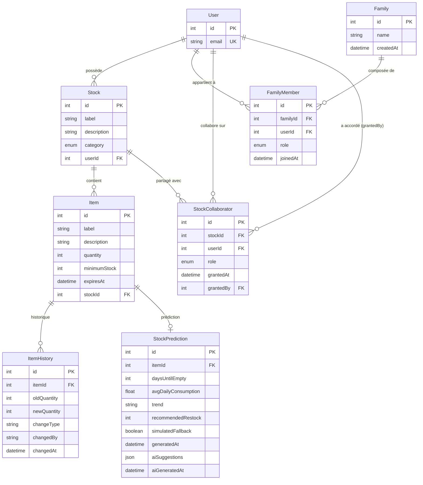

# Schéma de base de données — StockHub V2

> Source de vérité : `prisma/schema.prisma`
> Dernière mise à jour : avril 2026

---

## Diagramme ERD

---

## Décisions de modélisation

### `quantity` est sur `Item`, pas sur `Stock`

`Stock` est un **conteneur logique** (ex : "Cellier", "Peintures Warhammer"). Il ne porte pas de quantité agrégée car les items d'un stock sont hétérogènes — additionner des pots de yaourt et des boîtes de céréales n'a pas de sens métier.

La quantité est donc portée par chaque `Item`. Le `status` du stock (`optimal` / `low` / `critical` / `out-of-stock` / `overstocked`) est **calculé dynamiquement** à partir du statut individuel de ses items, sans dénormalisation.

> Décision documentée dans l'issue #79 (fermée).

### `minimumStock` sur `Item`

Le seuil d'alerte est propre à chaque article : 5 boîtes de céréales peut être `critical` alors que 5 pots de peinture est `optimal`. Il ne peut pas être défini au niveau du stock.

Logique de statut par item :

| Condition                        | Statut         |
| -------------------------------- | -------------- |
| `quantity == 0`                  | `out-of-stock` |
| `quantity <= minimumStock`       | `critical`     |
| `quantity <= minimumStock * 1.5` | `low`          |
| `quantity > minimumStock * 3`    | `overstocked`  |
| sinon                            | `optimal`      |

### `StockCollaborator` — table de jonction pour le partage

Un stock peut être partagé avec plusieurs utilisateurs avec des rôles différents (`OWNER`, `EDITOR`, `VIEWER`, `VIEWER_CONTRIBUTOR`). La relation `User ↔ Stock` est donc N-N avec attributs, implémentée via `StockCollaborator`.

Le champ `grantedBy` (FK nullable vers `User`) trace qui a accordé l'accès. `onDelete: SetNull` : si l'utilisateur ayant accordé l'accès est supprimé, la trace est effacée mais l'accès reste.

> Architecture documentée dans ADR-009.

### `ItemHistory` — traçabilité des mouvements

Chaque modification de quantité crée une entrée dans `item_history` avec `oldQuantity`, `newQuantity` et `changeType` (`CONSUMPTION` / `RESTOCK` / `ADJUSTMENT`). Cet historique alimente le `StockPredictionService` pour calculer la consommation moyenne quotidienne sur les 90 derniers jours.

> Architecture documentée dans ADR-014.

### `StockPrediction` — cache des prédictions déterministes

Un seul enregistrement de prédiction par item (`itemId` unique). Le champ `aiSuggestions` (JSON) cache le résultat du dernier appel LLM pour éviter les appels redondants. `aiGeneratedAt` trace la fraîcheur de ce cache.

> Architecture documentée dans ADR-014 et ADR-015.

### Enums

| Enum            | Valeurs                                           | Usage                            |
| --------------- | ------------------------------------------------- | -------------------------------- |
| `StockCategory` | `alimentation`, `hygiene`, `artistique`           | Catégorisation des stocks        |
| `FamilyRole`    | `ADMIN`, `MEMBER`                                 | Rôle au sein d'une famille       |
| `StockRole`     | `OWNER`, `EDITOR`, `VIEWER`, `VIEWER_CONTRIBUTOR` | Permissions sur un stock partagé |

---

## Contraintes d'intégrité

| Relation                             | `onDelete` | Justification                                                           |
| ------------------------------------ | ---------- | ----------------------------------------------------------------------- |
| `Item → Stock`                       | `Cascade`  | Supprimer un stock supprime tous ses items                              |
| `ItemHistory → Item`                 | `Cascade`  | L'historique n'a pas de sens sans l'item                                |
| `StockPrediction → Item`             | `Cascade`  | Idem                                                                    |
| `FamilyMember → Family/User`         | `Cascade`  | Quitter une famille ou supprimer un compte nettoie les memberships      |
| `StockCollaborator → Stock/User`     | `Cascade`  | Supprimer un stock ou un compte révoque les accès                       |
| `StockCollaborator.grantedBy → User` | `SetNull`  | Conservation de l'historique même si le donneur d'accès est supprimé    |
| `Stock → User`                       | `NoAction` | Un stock orphelin (userId null) reste accessible par ses collaborateurs |
