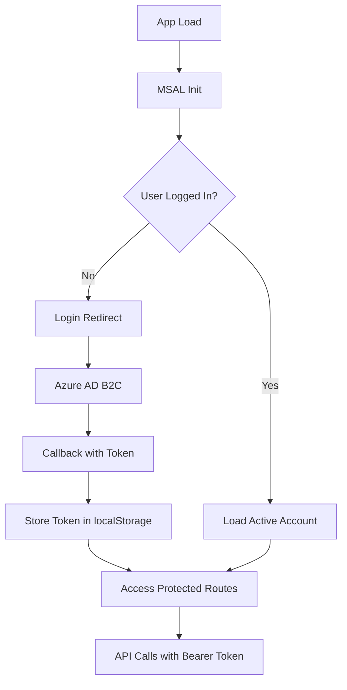

# Intégration Frontend V2 avec Backend

**Date**: 2025-12-29
**Auteur**: Session de développement avec Claude
**Statut**: Plan de migration V1 → V2

---

## Contexte

Le projet StockHub possède actuellement 3 repositories:

1. **Backend** (`stockhub_back`) - API Node.js/TypeScript avec DDD/CQRS
2. **Frontend V1** (`stockhub_front`) - React avec Azure AD B2C (déployé sur Azure, non fonctionnel en local)
3. **Frontend V2** (`stockHub_V2_front`) - React moderne, **non connecté au backend**

**Objectif**: Connecter le Frontend V2 au Backend en s'inspirant de l'architecture V1.

---

## Architecture V1 (Existante)

### Stack Technique V1

- **Framework**: React + TypeScript
- **Build**: Vite
- **Authentication**: Azure AD B2C via MSAL (`@azure/msal-browser`, `@azure/msal-react`)
- **API Client**: Fetch API avec ConfigManager
- **Token Storage**: localStorage (`authToken`)

### Flux d'Authentification V1



### Fichiers Clés V1

#### 1. `authConfig.ts` - Configuration Azure AD B2C

```typescript
export const msalConfig: Configuration = {
  auth: {
    clientId: '0dc4acfb-ecde-4f9b-81eb-9af050fb52d9',
    authority: b2cPolicies.authorities.signUpSignIn.authority,
    knownAuthorities: [b2cPolicies.authorityDomain],
    redirectUri: import.meta.env.VITE_REDIRECT_URI,
  },
  cache: {
    cacheLocation: 'localStorage',
    storeAuthStateInCookie: false,
  },
};

export const protectedResources = {
  stockHubApi: {
    endpoint: import.meta.env.VITE_API_SERVER_URL,
    scopes: {
      read: ['https://stockhubb2c.onmicrosoft.com/.../FilesRead'],
      write: ['https://stockhubb2c.onmicrosoft.com/.../FilesWrite'],
    },
  },
};
```

#### 2. `main.tsx` - Initialisation MSAL

```typescript
const msalInstance = new PublicClientApplication(msalConfig);

// Auto-select first account if available
if (!msalInstance.getActiveAccount() && msalInstance.getAllAccounts().length > 0) {
  msalInstance.setActiveAccount(msalInstance.getAllAccounts()[0]);
}

// Event listener pour capturer le token
msalInstance.addEventCallback((event) => {
  if (event.eventType === EventType.LOGIN_SUCCESS && event.payload) {
    msalInstance.setActiveAccount(event.payload.account);
  }
});

ReactDOM.createRoot(document.getElementById("root")!).render(
  <MsalProvider instance={msalInstance}>
    <App />
  </MsalProvider>
);
```

#### 3. `App.tsx` - Gestion du Token

```typescript
function ProtectedComponent({ onLogin }) {
  const { instance } = useMsal();

  useEffect(() => {
    const callbackId = instance.addEventCallback((event) => {
      if (event.eventType === EventType.LOGIN_SUCCESS && event.payload) {
        const token = event.payload.accessToken;
        localStorage.setItem("authToken", token); // ✅ Stockage du token
        console.log("Token acquired:", token);
      }
    });

    return () => instance.removeEventCallback(callbackId);
  }, [instance]);

  return <Router>...</Router>;
}
```

#### 4. `ConfigManager.ts` - Configuration API avec Token

```typescript
const getToken = (): Promise<string | null> => {
  return new Promise(resolve => {
    const checkToken = () => {
      const token = localStorage.getItem('authToken');
      if (token) {
        resolve(token);
      } else {
        setTimeout(checkToken, 100); // Retry après 100ms
      }
    };
    checkToken();
  });
};

class ConfigManager {
  static getApiServerUrl(version: number = 1): string {
    return import.meta.env.VITE_API_SERVER_URL + computeVersionPath(version);
  }

  static async getFetchConfig() {
    const token = await getToken();
    return {
      method: 'GET',
      headers: {
        Authorization: `Bearer ${token}`,
        'Content-Type': 'application/json',
      },
      credentials: 'include',
    };
  }

  // Similaire pour POST, PUT, DELETE...
}
```

#### 5. `StockAPIClient.ts` - Appels API

```typescript
export const fetchStocksList = async (): Promise<Stock[]> => {
  const { apiUrl, config } = await getApiConfig('GET', 2);
  const response = await fetch(`${apiUrl}/stocks`, config);

  if (!response.ok) {
    throw new Error(`HTTP ${response.status}`);
  }

  return response.json();
};
```

#### 6. `.env` - Variables d'Environnement V1

```env
VITE_API_SERVER_URL=http://localhost:3006/api
VITE_API_V1=/v1
VITE_API_V2=/v2
VITE_REDIRECT_URI=https://localhost:5173/
```

---

## Architecture V2 (Cible)

### Stack Technique V2

- **Framework**: React 19.1.0 + TypeScript 5.8.3
- **Build**: Vite 6.3.5
- **Styling**: TailwindCSS 3.4.1
- **Design System**: `@stockhub/design-system` (Web Components)
- **Routing**: React Router DOM 7.9.5
- **Tests**: Vitest (464 tests, 60.67% coverage)
- **Authentication**: ❌ **À IMPLÉMENTER**
- **API Client**: ❌ **À IMPLÉMENTER**

### Structure Actuelle V2

```
src/
├── components/       # Composants React (bien fourni)
├── contexts/         # ThemeContext, etc.
├── data/            # Mock data (stockData.ts)
├── hooks/           # Custom hooks
├── pages/           # Pages routing
├── types/           # Types TypeScript (api.ts existe)
├── utils/           # Utilitaires (aiPredictions, mlSimulation)
├── App.tsx
├── main.tsx
└── index.css
```

**Manquant**:

- ❌ Pas de configuration Azure AD B2C
- ❌ Pas de ConfigManager ou API Client
- ❌ Pas de gestion de token
- ❌ Pas de variables d'environnement pour l'API
- ✅ Types API basiques définis (`AsyncState<T>`, `ValidationError`)

---

## Plan de Migration V1 → V2

### Étape 1: Installation des Dépendances

```bash
cd C:\Users\sandr\Dev\RNCP7\StockHubV2\Front_End\stockHub_V2_front
npm install @azure/msal-browser @azure/msal-react
```

### Étape 2: Créer `.env` pour V2

Créer `.env` à la racine de V2:

```env
# API Backend
VITE_API_SERVER_URL=http://localhost:3006/api
VITE_API_V1=/v1
VITE_API_V2=/v2

# Azure AD B2C
VITE_REDIRECT_URI=http://localhost:5173/
VITE_CLIENT_ID=0dc4acfb-ecde-4f9b-81eb-9af050fb52d9
VITE_TENANT_NAME=stockhubb2c
VITE_AUTHORITY_DOMAIN=stockhubb2c.b2clogin.com
VITE_SIGN_UP_SIGN_IN_POLICY=B2C_1_signupsignin
VITE_FORGOT_PASSWORD_POLICY=B2C_1_reset_password
VITE_EDIT_PROFILE_POLICY=B2C_1_edit_profile

# Scopes
VITE_SCOPE_READ=https://stockhubb2c.onmicrosoft.com/dc30ef57-cdc1-4a3e-aac5-9647506a72ef/FilesRead
VITE_SCOPE_WRITE=https://stockhubb2c.onmicrosoft.com/dc30ef57-cdc1-4a3e-aac5-9647506a72ef/FilesWrite
```

**⚠️ IMPORTANT**: Ajouter `.env` à `.gitignore` si ce n'est pas déjà fait.

### Étape 3: Créer `src/config/authConfig.ts`

```typescript
import { Configuration, LogLevel } from '@azure/msal-browser';

// Policies Azure AD B2C
export const b2cPolicies = {
  names: {
    signUpSignIn: import.meta.env.VITE_SIGN_UP_SIGN_IN_POLICY,
    forgotPassword: import.meta.env.VITE_FORGOT_PASSWORD_POLICY,
    editProfile: import.meta.env.VITE_EDIT_PROFILE_POLICY,
  },
  authorities: {
    signUpSignIn: {
      authority: `https://${import.meta.env.VITE_AUTHORITY_DOMAIN}/${import.meta.env.VITE_TENANT_NAME}.onmicrosoft.com/${import.meta.env.VITE_SIGN_UP_SIGN_IN_POLICY}`,
    },
    forgotPassword: {
      authority: `https://${import.meta.env.VITE_AUTHORITY_DOMAIN}/${import.meta.env.VITE_TENANT_NAME}.onmicrosoft.com/${import.meta.env.VITE_FORGOT_PASSWORD_POLICY}`,
    },
    editProfile: {
      authority: `https://${import.meta.env.VITE_AUTHORITY_DOMAIN}/${import.meta.env.VITE_TENANT_NAME}.onmicrosoft.com/${import.meta.env.VITE_EDIT_PROFILE_POLICY}`,
    },
  },
  authorityDomain: import.meta.env.VITE_AUTHORITY_DOMAIN,
};

// Configuration MSAL
export const msalConfig: Configuration = {
  auth: {
    clientId: import.meta.env.VITE_CLIENT_ID,
    authority: b2cPolicies.authorities.signUpSignIn.authority,
    knownAuthorities: [b2cPolicies.authorityDomain],
    redirectUri: import.meta.env.VITE_REDIRECT_URI,
  },
  cache: {
    cacheLocation: 'localStorage',
    storeAuthStateInCookie: false,
  },
  system: {
    loggerOptions: {
      loggerCallback: (level, message, containsPii) => {
        if (containsPii) return;
        switch (level) {
          case LogLevel.Error:
            console.error(message);
            return;
          case LogLevel.Info:
            console.info(message);
            return;
          case LogLevel.Verbose:
            console.debug(message);
            return;
          case LogLevel.Warning:
            console.warn(message);
            return;
        }
      },
    },
  },
};

// Protected Resources
export const protectedResources = {
  stockHubApi: {
    endpoint: import.meta.env.VITE_API_SERVER_URL,
    scopes: {
      read: [import.meta.env.VITE_SCOPE_READ],
      write: [import.meta.env.VITE_SCOPE_WRITE],
    },
  },
};

// Login Request
export const loginRequest = {
  scopes: [
    ...protectedResources.stockHubApi.scopes.read,
    ...protectedResources.stockHubApi.scopes.write,
  ],
};
```

### Étape 4: Créer `src/services/api/ConfigManager.ts`

```typescript
const CONTENT_TYPE = 'Content-Type';
const APPLICATION_JSON = 'application/json';
const AUTHORIZATION = 'Authorization';

/**
 * Attend que le token soit disponible dans localStorage
 */
const getToken = (): Promise<string | null> => {
  return new Promise(resolve => {
    const checkToken = () => {
      const token = localStorage.getItem('authToken');
      if (token) {
        resolve(token);
      } else {
        setTimeout(checkToken, 100);
      }
    };
    checkToken();
  });
};

/**
 * Calcule le path de version (v1 ou v2)
 */
function computeVersionPath(version: number): string {
  if (version === 2) {
    return import.meta.env.VITE_API_V2;
  }
  return import.meta.env.VITE_API_V1;
}

/**
 * Gestionnaire de configuration pour les appels API
 */
class ConfigManager {
  /**
   * Construit l'URL complète de l'API
   */
  static getApiServerUrl(version: number = 2): string {
    return import.meta.env.VITE_API_SERVER_URL + computeVersionPath(version);
  }

  /**
   * Configuration pour GET requests
   */
  static async getFetchConfig(): Promise<RequestInit> {
    const token = await getToken();
    return {
      method: 'GET',
      headers: {
        [AUTHORIZATION]: `Bearer ${token}`,
        [CONTENT_TYPE]: APPLICATION_JSON,
      },
      credentials: 'include',
    };
  }

  /**
   * Configuration pour POST requests
   */
  static async postFetchConfig(body: Record<string, unknown>): Promise<RequestInit> {
    const token = await getToken();
    return {
      method: 'POST',
      headers: {
        [AUTHORIZATION]: `Bearer ${token}`,
        [CONTENT_TYPE]: APPLICATION_JSON,
      },
      credentials: 'include',
      body: JSON.stringify(body),
    };
  }

  /**
   * Configuration pour PUT requests
   */
  static async putFetchConfig(body: Record<string, unknown>): Promise<RequestInit> {
    const token = await getToken();
    return {
      method: 'PUT',
      headers: {
        [AUTHORIZATION]: `Bearer ${token}`,
        [CONTENT_TYPE]: APPLICATION_JSON,
      },
      credentials: 'include',
      body: JSON.stringify(body),
    };
  }

  /**
   * Configuration pour DELETE requests
   */
  static async deleteFetchConfig(body?: Record<string, unknown>): Promise<RequestInit> {
    const token = await getToken();
    return {
      method: 'DELETE',
      headers: {
        [AUTHORIZATION]: `Bearer ${token}`,
        [CONTENT_TYPE]: APPLICATION_JSON,
      },
      credentials: 'include',
      body: body ? JSON.stringify(body) : undefined,
    };
  }
}

export default ConfigManager;
```

### Étape 5: Créer `src/services/api/utils.ts`

```typescript
import ConfigManager from './ConfigManager';

/**
 * Helper pour obtenir la config API selon la méthode HTTP
 */
export async function getApiConfig(
  method: 'GET' | 'POST' | 'PUT' | 'DELETE' = 'GET',
  version: number = 2,
  body?: Record<string, unknown>
): Promise<{ apiUrl: string; config: RequestInit }> {
  const apiUrl = ConfigManager.getApiServerUrl(version);
  let config: RequestInit;

  switch (method) {
    case 'PUT':
      config = await ConfigManager.putFetchConfig(body ?? {});
      break;
    case 'POST':
      config = await ConfigManager.postFetchConfig(body ?? {});
      break;
    case 'DELETE':
      config = await ConfigManager.deleteFetchConfig(body);
      break;
    case 'GET':
    default:
      config = await ConfigManager.getFetchConfig();
      break;
  }

  return { apiUrl, config };
}
```

### Étape 6: Créer `src/services/api/stocksAPI.ts`

```typescript
import { getApiConfig } from './utils';

/**
 * Types (à adapter selon le backend)
 */
export interface Stock {
  id: string;
  name: string;
  quantity: number;
  // ... autres champs
}

export interface CreateStockDTO {
  name: string;
  quantity: number;
  // ... autres champs
}

/**
 * Client API pour les Stocks
 */
export class StocksAPI {
  /**
   * Récupère la liste de tous les stocks
   */
  static async fetchStocksList(): Promise<Stock[]> {
    try {
      const { apiUrl, config } = await getApiConfig('GET', 2);
      console.log('Fetching stocks list with config:', config);

      const response = await fetch(`${apiUrl}/stocks`, config);

      if (!response.ok) {
        console.error('Error fetching stocks list');
        throw new Error(`HTTP response with status ${response.status}`);
      }

      const data = await response.json();
      console.log('Stocks data received:', data);
      return data as Stock[];
    } catch (error) {
      console.error('Error in fetchStocksList:', error);
      throw error;
    }
  }

  /**
   * Récupère un stock par ID
   */
  static async fetchStockById(id: string): Promise<Stock> {
    try {
      const { apiUrl, config } = await getApiConfig('GET', 2);
      const response = await fetch(`${apiUrl}/stocks/${id}`, config);

      if (!response.ok) {
        throw new Error(`HTTP response with status ${response.status}`);
      }

      return response.json();
    } catch (error) {
      console.error(`Error fetching stock ${id}:`, error);
      throw error;
    }
  }

  /**
   * Crée un nouveau stock
   */
  static async createStock(stock: CreateStockDTO): Promise<Stock> {
    try {
      const { apiUrl, config } = await getApiConfig('POST', 2, stock);
      const response = await fetch(`${apiUrl}/stocks`, config);

      if (!response.ok) {
        throw new Error(`HTTP response with status ${response.status}`);
      }

      return response.json();
    } catch (error) {
      console.error('Error creating stock:', error);
      throw error;
    }
  }

  /**
   * Met à jour un stock existant
   */
  static async updateStock(id: string, updates: Partial<Stock>): Promise<Stock> {
    try {
      const { apiUrl, config } = await getApiConfig('PUT', 2, updates);
      const response = await fetch(`${apiUrl}/stocks/${id}`, config);

      if (!response.ok) {
        throw new Error(`HTTP response with status ${response.status}`);
      }

      return response.json();
    } catch (error) {
      console.error(`Error updating stock ${id}:`, error);
      throw error;
    }
  }

  /**
   * Supprime un stock
   */
  static async deleteStock(id: string): Promise<void> {
    try {
      const { apiUrl, config } = await getApiConfig('DELETE', 2);
      const response = await fetch(`${apiUrl}/stocks/${id}`, config);

      if (!response.ok) {
        throw new Error(`HTTP response with status ${response.status}`);
      }
    } catch (error) {
      console.error(`Error deleting stock ${id}:`, error);
      throw error;
    }
  }
}
```

### Étape 7: Modifier `src/main.tsx`

```typescript
import React from 'react';
import ReactDOM from 'react-dom/client';
import {
  AuthenticationResult,
  AuthError,
  EventType,
  PublicClientApplication,
} from '@azure/msal-browser';
import { msalConfig, b2cPolicies, loginRequest } from './config/authConfig';
import { MsalProvider } from '@azure/msal-react';
import App from './App';
import './index.css';

// Initialisation MSAL
const msalInstance = new PublicClientApplication(msalConfig);

// Auto-sélection du premier compte si disponible
if (!msalInstance.getActiveAccount() && msalInstance.getAllAccounts().length > 0) {
  msalInstance.setActiveAccount(msalInstance.getAllAccounts()[0]);
}

// Event listener pour gérer l'authentification
msalInstance.addEventCallback((event) => {
  console.debug('MSAL Event received:', event.eventType);

  // Cas: utilisateur a cliqué sur "Forgot password"
  if (event.eventType === EventType.LOGIN_FAILURE && event.error) {
    const error = event.error as AuthError;
    const message = error.errorMessage || error.message || '';

    if (message.includes('AADB2C90118')) {
      console.warn('Forgot Password triggered → redirecting to password reset flow');

      msalInstance.loginRedirect({
        authority: b2cPolicies.authorities.forgotPassword.authority,
        scopes: loginRequest.scopes,
      });
      return;
    }

    console.error('Login failure:', event.error);
  }

  // Authentification réussie → setActiveAccount
  if (
    (event.eventType === EventType.LOGIN_SUCCESS ||
      event.eventType === EventType.ACQUIRE_TOKEN_SUCCESS ||
      event.eventType === EventType.SSO_SILENT_SUCCESS) &&
    event.payload &&
    (event.payload as AuthenticationResult).account
  ) {
    msalInstance.setActiveAccount((event.payload as AuthenticationResult).account);
  }
});

ReactDOM.createRoot(document.getElementById('root')!).render(
  <React.StrictMode>
    <MsalProvider instance={msalInstance}>
      <App />
    </MsalProvider>
  </React.StrictMode>
);
```

### Étape 8: Modifier `src/App.tsx`

```typescript
import { useEffect } from 'react';
import { BrowserRouter as Router, Route, Routes } from 'react-router-dom';
import { useMsal } from '@azure/msal-react';
import { AuthenticationResult, EventType } from '@azure/msal-browser';
import { b2cPolicies, protectedResources } from './config/authConfig';

// Vos pages/composants existants
import HomePage from './pages/HomePage';
// ... autres imports

interface ProtectedComponentProps {
  onLogin: () => void;
}

function ProtectedComponent({ onLogin }: ProtectedComponentProps) {
  const { instance } = useMsal();

  useEffect(() => {
    const callbackId = instance.addEventCallback((event) => {
      if (
        (event.eventType === EventType.LOGIN_SUCCESS ||
          event.eventType === EventType.ACQUIRE_TOKEN_SUCCESS) &&
        event.payload &&
        (event.payload as AuthenticationResult).account
      ) {
        const payload = event.payload as AuthenticationResult;
        const token = payload.accessToken;

        // ✅ Stockage du token dans localStorage
        localStorage.setItem('authToken', token);
        console.log('Token acquired and stored');
      }
    });

    return () => {
      if (callbackId) {
        instance.removeEventCallback(callbackId);
      }
    };
  }, [instance]);

  return (
    <Router>
      <Routes>
        <Route path="/" element={<HomePage />} />
        {/* Vos autres routes */}
      </Routes>
    </Router>
  );
}

function App() {
  const { instance } = useMsal();

  const signUpSignInFlowRequest = {
    authority: b2cPolicies.authorities.signUpSignIn.authority,
    scopes: [
      ...protectedResources.stockHubApi.scopes.read,
      ...protectedResources.stockHubApi.scopes.write,
    ],
  };

  const handleLogin = async () => {
    try {
      await instance.loginRedirect(signUpSignInFlowRequest);
    } catch (error) {
      console.error('Erreur lors de la connexion:', error);
    }
  };

  return (
    <div>
      <ProtectedComponent onLogin={handleLogin} />
    </div>
  );
}

export default App;
```

### Étape 9: Utiliser l'API dans un Composant

Exemple de composant `StocksList.tsx`:

```typescript
import { useEffect, useState } from 'react';
import { StocksAPI, Stock } from '../services/api/stocksAPI';

export function StocksList() {
  const [stocks, setStocks] = useState<Stock[]>([]);
  const [loading, setLoading] = useState(true);
  const [error, setError] = useState<string | null>(null);

  useEffect(() => {
    async function loadStocks() {
      try {
        setLoading(true);
        const data = await StocksAPI.fetchStocksList();
        setStocks(data);
      } catch (err) {
        setError(err instanceof Error ? err.message : 'Unknown error');
      } finally {
        setLoading(false);
      }
    }

    loadStocks();
  }, []);

  if (loading) return <div>Loading...</div>;
  if (error) return <div>Error: {error}</div>;

  return (
    <div>
      <h1>Stocks List</h1>
      <ul>
        {stocks.map((stock) => (
          <li key={stock.id}>{stock.name} - {stock.quantity}</li>
        ))}
      </ul>
    </div>
  );
}
```

---

## Checklist de Migration

- [ ] **Étape 1**: Installer dépendances MSAL
- [ ] **Étape 2**: Créer fichier `.env` avec variables d'environnement
- [ ] **Étape 3**: Créer `src/config/authConfig.ts`
- [ ] **Étape 4**: Créer `src/services/api/ConfigManager.ts`
- [ ] **Étape 5**: Créer `src/services/api/utils.ts`
- [ ] **Étape 6**: Créer `src/services/api/stocksAPI.ts`
- [ ] **Étape 7**: Modifier `src/main.tsx` pour initialiser MSAL
- [ ] **Étape 8**: Modifier `src/App.tsx` pour capturer le token
- [ ] **Étape 9**: Tester l'authentification (login/logout)
- [ ] **Étape 10**: Tester les appels API (GET /stocks)
- [ ] **Étape 11**: Mettre à jour CLAUDE.md avec les nouveaux endpoints
- [ ] **Étape 12**: Documenter dans session doc

---

## Endpoints Backend à Implémenter

Selon l'architecture DDD/CQRS du backend, les endpoints suivants doivent être créés/vérifiés:

### Stocks

- `GET /api/v2/stocks` - Liste tous les stocks
- `GET /api/v2/stocks/:id` - Détails d'un stock
- `POST /api/v2/stocks` - Créer un stock
- `PUT /api/v2/stocks/:id` - Mettre à jour un stock
- `DELETE /api/v2/stocks/:id` - Supprimer un stock

### Manipulations

- `GET /api/v2/stocks/:stockId/manipulations` - Liste manipulations d'un stock
- `POST /api/v2/stocks/:stockId/manipulations` - Créer manipulation

### Autres endpoints selon besoins...

**⚠️ IMPORTANT**: Vérifier que le backend expose bien ces routes avec l'authentification Azure AD B2C.

---

## Dépendances Backend

Le backend doit avoir:

1. ✅ **Middleware d'authentification Azure AD B2C** (voir `docs/technical/azure-b2c-setup.md`)
2. ✅ **CORS configuré** pour accepter les requêtes depuis `http://localhost:5173`
3. ✅ **Routes v2** implémentées

Voir le fichier backend `src/serverSetup/serverSetup.ts` pour la configuration actuelle.

---

## Tests à Effectuer

### 1. Tests d'Authentification

- [ ] Login avec Azure AD B2C réussit
- [ ] Token stocké dans localStorage
- [ ] Redirection correcte après login
- [ ] Forgot password fonctionne
- [ ] Logout fonctionne

### 2. Tests API

- [ ] GET /api/v2/stocks retourne la liste
- [ ] GET /api/v2/stocks/:id retourne un stock
- [ ] POST /api/v2/stocks crée un nouveau stock
- [ ] PUT /api/v2/stocks/:id met à jour
- [ ] DELETE /api/v2/stocks/:id supprime
- [ ] Erreurs 401 si token invalide
- [ ] Erreurs 403 si scopes insuffisants

### 3. Tests E2E

- [ ] Scénario complet: Login → List Stocks → View Details → Logout
- [ ] Gestion des erreurs réseau
- [ ] Refresh token automatique

---

## Prochaines Étapes

1. **Session de développement**: Implémenter les étapes 1-8
2. **Tests locaux**: Backend + Frontend V2 en local
3. **Documentation**: Mettre à jour CLAUDE.md du frontend V2
4. **Commit**: Créer une branche `feat/backend-integration`
5. **PR**: Créer PR pour review

---

## Références

- **Azure AD B2C Setup**: `docs/technical/azure-b2c-setup.md`
- **Backend Auth**: Voir middleware dans `src/authentication/`
- **Frontend V1**: `C:\Users\sandr\Dev\Perso\Projets\stockhub\stockhub_front`
- **Frontend V2**: `C:\Users\sandr\Dev\RNCP7\StockHubV2\Front_End\stockHub_V2_front`

---

**Auteurs**: Session de développement 2025-12-29
**Statut**: Documentation complète - Prêt pour implémentation
